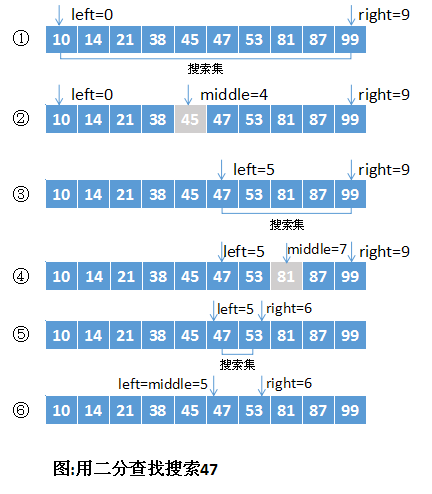

# **二分搜索算法**

## *题目描述*

给定已按升序排好序的n个元素a[0:n-1]，现要在这n个元素中找出一特定元素x

## *题目分析*

二分搜索算法（折半查找法）是运用分治策略的典型例子。

满足分治法的4个适用条件。很显然此问题分解出的子问题相互独立，即在a[i]的前面或后面查找x是独立的子问题，因此满足分治法的第四个适用条件。

## *算法实现*

1. C语言实现

```C
#include <stdio.h>
 
int binarySearch(int a[], const int& x, int n)
{
    int left=0, right=n-1;
    while (left <= right)
    {
        int middle = (left+right)/2;
        if (x==a[middle])
        {
            return middle;
        }
        if (x > a[middle])
        {
            left = middle+1;
        }
        else
        {
            right = middle-1;
        }
    }
    return -1;
}
 
int main()
{
    int a[] = {1,2,5,7,8,10};
    printf("%d\n",binarySearch(a,8,6));
    return 0;
}
```

2. JAVA语言实现

```JAVA
//java代码
  public int searchInsert(int[] nums, int target) {
        int l = 0;
        int r = nums.length-1;//在[l...h]的范围里查找target
        while (l <= r ) {//当l==h时，区间[l...h]依然有效
            int mid = l + (r  - l) / 2;//(l+r)/2== l + (r  - l) / 2
            if (target > nums[mid]) {
                l = mid + 1;//target在区间[mid+1...r]中
            }
            if (target < nums[mid]) {
                r  = mid - 1;//target在区间[l...mid+1]中
            }
            if (target == nums[mid]) {//相等返回下标
                return mid;
            }
        }
        //没有查找到返回-1。
        return -l;
    }
```

## *图解示意*



## *参考网址*

[点此进入](https://www.cnblogs.com/kyoner/p/11080078.html)
