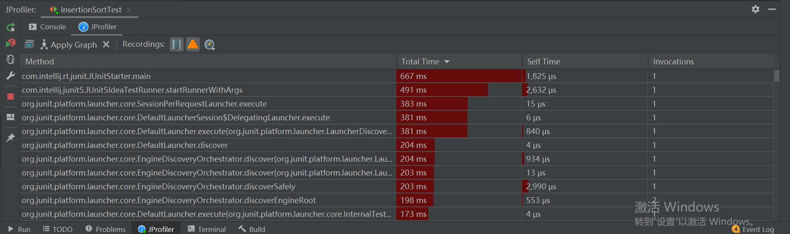
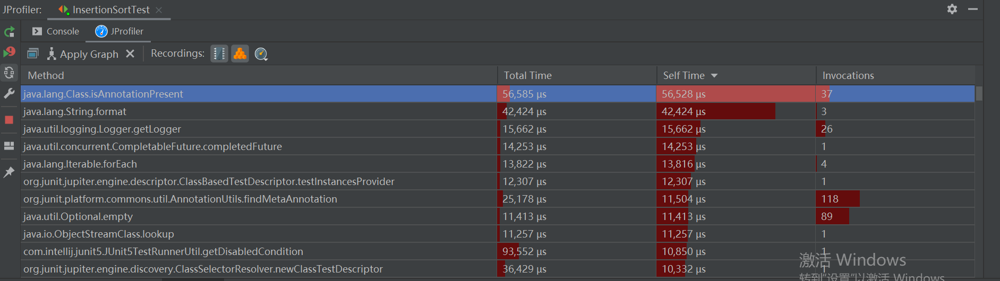

# **week2作业插入排序算法**

## *作业描述*
请使用Java的Profile根据探究插入排序中什么操作最耗时，并写出过程和结论。

## *探究过程*
1. 使用工具：
Intellij IDEA的Profile分析工具
2. 具体代码：
```JAVA
public class InsertionSort {
    public static void sort(int[] a){
        for (int i=0;i<a.length-1;i++){
            for(int j=i+1;j>0;j--){
                if(a[j]<a[j-1]) {
                    int temp = a[j];
                    a[j]=a[j-1];
                    a[j-1]=temp;
                }
            }
        }
    }
}

//单元测试
class InsertionSortTest {
    @org.junit.jupiter.api.Test
    void sort() {
        int a[]={2,6,8,4,3,9,7};
        InsertionSort.sort(a);
    }
}
```
3. 进行分析并得出结论：


TotalTime(us)

- 函数从Call到Return总共消耗的时间，单位为us

- 该值会受Profiler本身开销影响，主要是Profiler取Time的开销（因为Profiler取Time必须是同步的，但比如自增函数的开销比取Time开销还小，势必会造成误差，可以控制ProfileDepth来消除）


 SelfTime(us)

- 代表该函数自身的开销

- TotalTime减去各子节点的TotalTime

从selftime排序结果来看，java.lang.class.isAnnotationPresent方法占用时间最多。这个方法表示如果指定类型的注释存在于此元素上,返回true，否则返回false。这种方法的设计主要是为了方便访问标记注释。所以在插入排序过程中，我们可以知道在进行a[j]和a[j-1]的比较时耗时较多。随着输入规模的增长,插入排序比较、移动次数在呈指数级快速增长。对于一些自定义类型而言，他们的比较、复制操作的耗时往往是整数的数倍之多。较为耗时。


